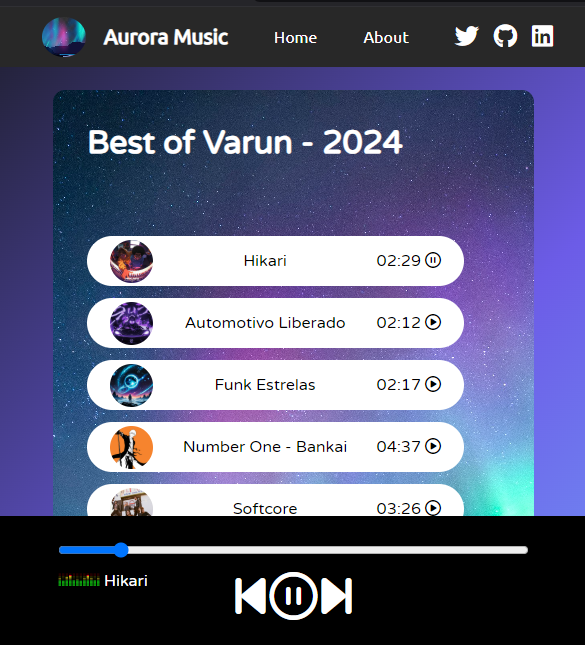

# 🎶 Aurora Music App

Welcome to **Aurora Music**, a custom-built music player inspired by real-time JavaScript development practices. Created to explore dynamic front-end functionality, this app offers a seamless experience for playing and managing your favorite tunes.


## 🚀 Features

- 🎧 **Custom Playlist**: A curated list titled *Best of Varun - 2024* for an immersive music experience.
- 🌌 **Beautiful UI**: A stunning aurora-themed background for an aesthetically pleasing interface.
- ▶️ **Interactive Controls**: Simple play/pause functionality with a dynamic progress bar.
- 📱 **Responsive Design**: Works seamlessly on desktop and mobile devices.
- ⏱ **Real-time Development**: Built to practice modern **JavaScript** techniques.

---

## 🛠️ Tech Stack

- **HTML5**: Markup structure for the app.
- **CSS3**: Styled for responsiveness and clean UI.
- **JavaScript (Vanilla)**: Core logic for real-time interactivity and music controls.

---

## 📷 Preview



---

## 🔧 Installation

1. Clone the repository:
   ```bash
   git clone https://github.com/your-username/aurora-music.git
